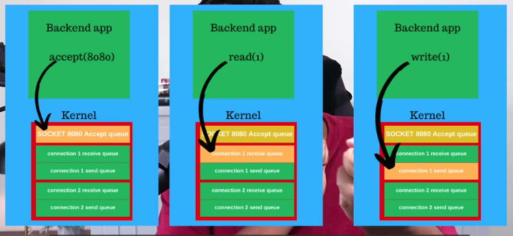

# Simple HTTP Server in C

This project implements a basic HTTP server in C that listens on port 8080 and responds with a "Hello world!" message to any incoming request.

## Table of Contents

- [Features](#features)
- [Prerequisites](#prerequisites)
- [Installation](#installation)
- [Usage](#usage)
- [How It Works](#how-it-works)
- [Contributing](#contributing)
- [License](#license)

## Features

- Simple HTTP server implementation in C
- Listens on port 8080
- Handles incoming connections
- Responds with a "Hello world!" message

## Prerequisites

- GCC compiler
- Basic knowledge of C programming
- Understanding of socket programming concepts

## Installation

1. Clone this repository or download the source code.
2. Open a terminal and navigate to the project directory.
3. Compile the code using GCC:

```bash
gcc -o output index.c
```

## Usage

1. Run the compiled executable:

```bash
./output
```

2. The server will start and listen on port 8080.
3. Open a web browser or use a tool like curl to send a request to `http://localhost:8080`.
4. You should receive a "Hello world!" response.



## How It Works

This HTTP server works as follows:

1. Creates a socket and binds it to port 8080.
2. Listens for incoming connections.
3. Accepts client connections in an infinite loop.
4. Reads the client request (but doesn't parse it).
5. Sends a hardcoded HTTP response with "Hello world!".
6. Closes the client connection and waits for the next one.

## y components:

- `socket()`: Creates the server socket.
- `bind()`: Binds the socket to the specified port.
- `listen()`: Sets up a queue for incoming connections.
- `accept()`: Accepts a client connection.
- `read()`: Reads data from the client.
- `write()`: Sends the response to the client.
